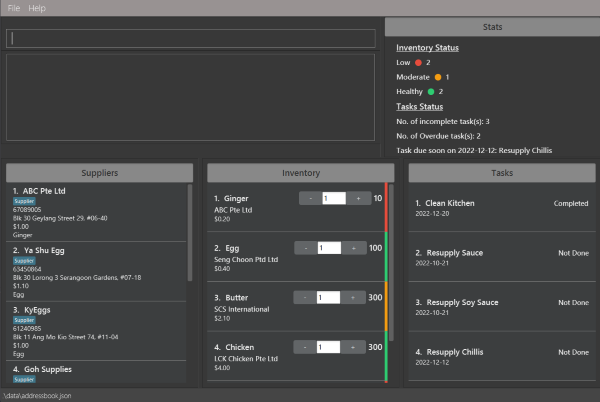
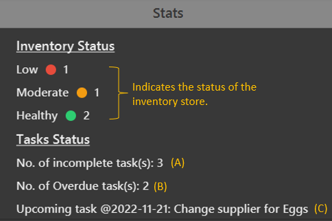

Salesy is a desktop app for helping food vendors manage details of their clients and suppliers, optimized for use via a Command Line Interface (CLI) while still having the benefits of a Graphical User Interface (GUI). If you can type fast and remember the commands well, Salesy can get your contact management tasks done faster than traditional GUI apps.

* Table of Contents
{:toc}

--------------------------------------------------------------------------------------------------------------------

## Quick start

1. Ensure you have Java SDK `11` or above installed in your Computer.

1. Download the latest `Salesy.jar` from [here](https://github.com/AY2223S1-CS2103T-W08-4/tp/releases).

1. Copy the file to the folder you want to use as your home folder in Salesy.

1. Double-click the file to start the app. The GUI should appear in a few seconds.

1. Type in the command box and press Enter to execute it.

1. Refer to the [Features](#features) below for details of each command.

--------------------------------------------------------------------------------------------------------------------

## Features

### Statistics Panel

A brief display of important information for **inventory** and **tasks**.

**An overview of the information panel**

**More information**

* **(A)** `Incomplete` tasks refers to tasks that are shown as `Not Done`. 
* **(B)** `Overdue` tasks refers to tasks that are both `Not Done` and has deadline that is
past today's date.
  * For example: Today's date is **_11 Feb 2022_** and your task's deadline is _**10 Feb 2022**_, this will be counted as `Overdue`.
* **(C)** `Upcoming` tasks refers to tasks that have deadline of today's date and the dates after today.
  * For example: Today's date is **_11 Feb 2022_** and your task's deadline is _**11 Feb 2022 or after**_, this will be counted as `Upcoming`.

### Colors used for Inventory

Simple and intuitive colors are used to identify stock levels.

**Examples:**

Inventory Status in the [Stats Panel](#Statistics Panel).

Inventory Cards for Items

**Detailed Explanation**

| Color          | Meaning                                                          | How is it determined ?                                                                              |
|----------------|------------------------------------------------------------------|-----------------------------------------------------------------------------------------------------|
| 🔴&nbsp;Red    | Running at `near or below minimum`, restock as soon as possible. | **Less than 120%** of minimum stock specified.                                                      |
| 🟠&nbsp;Orange | Running at a `moderate` level, can consider restocking soon.     | **More than and equal to 120%** of minimum stock specified and **less than 165%** of minimum stock. |
| 🟢&nbsp;Green  | Running at a `healthy` level no worries about restocking.        | **More than and equal to 165%** of minimum stock specified.                                         |

### Add supplier/task/supply item: `add`

Adds an item of a specified type with the given details

***Format:*** 

`add [n/NAME] [p/PHONE] [pr/PRICE] [i/ITEM] [a/ADDRESS] [t/Supplier]` (supplier)

`addTask [d/TASKNAME] [dl/DEADLINE] [t/TAG_NAME]` (task)

`addItem <supplier index> [c/CURRENTSTOCK] [m/MINIMUMSTOCK]` (supply item)

**Things you can add:**
* Suppliers
* Tasks
* Supply Item (Item in inventory)

**Examples:**

Add a supplier to Salesy’s address book

>`add n/ABC PTE LTD p/67009000 pr/$1.10 i/Egg a/Blk 140 Woodlands Ave 3 t/Supplier`

Add a task to Salesy

>`addTask d/Pass ingredients to XXX Pte Ltd dl/2022-12-12`

Add a SupplyItem to Salesy's inventory

SupplyItem from first supplier in address book added
    
>`addItem 1 c/10 m/3` 

### Delete: `delete`

Delete the specified item of the specified type from Salesy

***Format:*** 

`delete <supplier index>` (supplier)

`deleteTask <task index>` (task)

`deleteItem <item index>` (supply item)

**Things you can delete:**
* Suppliers
* Tasks
* Supply items 

**Examples**

Delete a supplier

> `delete 1`

Delete a task

> `deleteTask 2`

Delete an item in inventory

> `deleteItem 1`

### Mark: `mark`

Marks the specified task as done to keep task list updated

***Format:*** 

`mark <task index>`

**Things you can mark:**
* Tasks only

**Examples**

Mark a task that you have completed

> `mark 2`

### Unmark: `unmark`

Unmarks a previously marked task

***Format:*** 

`unmark <task index>`

**Things you can unmark:**
* Tasks only

**Examples**

Unmark a task that you have completed

> `unmark 3`

### Edit: `edit`

Edit a specified item's details

***Format:***

`edit <supplier index> [n/NAME] [p/PHONE] [pr/PRICE] [i/ITEM] [a/ADDRESS] [t/TAG]` (supplier)

`editTask <task index> [d/DESCRIPTION] [dl/DEADLINE] [t/TAGS]` (task)

`editStock <item index> [c/NEWCURRENTSTOCK]` (supply item)

**Things you can edit:**
* Supplier details
* Tasks
* Supply Item stock 

**Examples**

* Edit supplier details

> `edit 3 pr/NEW PRICE`

* Edit task details

> `editTask 1 dl/2022-10-10`

* Edit supply item stock count

> `editStock 1 c/7`

### Find: `find`

Find suppliers based on name or item

***Format:***

`find [n/NAMEVALUE]` (supplier name)

`find [i/ITEMVALUE]` (supplier item)

**Examples**

* Find suppliers with name John Cena

> `find n/John Cena`

* Find suppliers who supply Eggs

> `find i/Egg`

### Increment / Decrement current stock in your inventory

Increase or decrease your stock for a particular item in the inventory

**Steps**

1. Take a look at the inventory panel at the bottom-middle section of the application.
2. Decide on which item you want to modify the stock of.
3. Hover your mouse over item and the white text box with a value `1` in it.
4. Key in your desired amount to add or decrease by.

5. Press the `+` icon to add your desired amount (or press the `-` icon to minus your desired amount).

***Notice that the current stock of Ginger increased by your desired amount.***

**Limitations**

* Only able to key in up to a 5 digit value.
* Only able to key in positive values

### List all data : `listAll`

Lists all items.

***Format:*** 

`listAll`

**Examples**

* List all entities

> `listAll`

### List all suppliers/tasks/inventory

### List all suppliers: `listSuppliers`

Lists all suppliers

***Format:*** 

`listSuppliers`

**Examples**

* List all suppliers

> `listSuppliers`

### List all tasks: `listTasks`

Lists all tasks

***Format:*** 

`listTasks`

**Examples**

* List all tasks

> `listTasks`

### List everything in the inventory: `listInventory`

Lists whole inventory.

***Format:*** 

`listInventory`  

**Examples**

* List all items

> `listInventory`

### Sort: `sort`

Sorts and displays items based on sorting criteria

***Format:*** 

`sort /<item type> <sort criteria> <ascending/descending>`

**Available sorting criteria:**
* Task details (name, type, time, marked status)
* Supplier details (name, type, price, address)
* Customer details (name, contact, order)

**Examples:**
* Sort by task deadline date, in descending order

> `sortTask /date descending`

* Sort by supplier address, in ascending order

> `sortSupplier /address ascending`

--------------------------------------------------------------------------------------------------------------------

## Command summary

| Action                       | Format                                                                | Examples                                                                           |
|------------------------------|-----------------------------------------------------------------------|------------------------------------------------------------------------------------|
| **list** (supplier)          | `listSuppliers`                                                       | `listSuppliers`                                                                    |
| **add**  (supplier)          | `add [n/NAME] [p/PHONE] [pr/PRICE] [i/ITEM] [a/ADDRESS] [t/Supplier]` | `add n/ABC PTE LTD p/67009000 pr/$1.10 i/Egg a/Blk 140 Woodlands Ave 3 t/Supplier` |
| **delete** (supplier)        | `delete <supplier index>`                                             | `delete 1`                                                                         |
| **edit**  (supplier)         | `edit <supplier index> <attribute name>/ <new value>`                 | `edit 3 pr/NEW PRICE`                                                              |
| **find**  (supplier)         | `find [n/NAMEVALUE]`    `find [i/ITEMVALUE]`                       | `find n/John Cena`   `find i/Egg`                                               |
| **list** (task)              | `listTasks`                                                           | `listTasks`                                                                        |
| **add** (task)               | `addTask [d/DETAILS] [dl/DEADLINE] [t/TAGS]`                          | `addTask d/Restock Eggs dl/2022-12-12 t/Urgent`                                    |
| **delete** (task)            | `deleteTask <task index>`                                             | `deleteTask 1`                                                                     |
| **edit** (task)              | `editTask <task index> <attribute name>/ <new value>`                 | `editTask 1 dl/2029-12-12`                                                         |
| **mark**  (task)             | `mark <task index>`                                                   | `mark 1`                                                                           |
| **unmark** (task)            | `unmark <task index>`                                                 | `unmark 2`                                                                         |
| **list** (supply item)       | `listInventory`                                                       | `listInventory`                                                                    |
| **add** (supply item)        | `addItem <supplier index> [c/CURRENTSTOCK] [m/MINIMUMSTOCK]`          | `addItem 2 c/10 m/3`                                                               |
| **delete** (supply item)     | `deleteItem <item index>`                                             | `deleteItem 2`                                                                     |
| **edit stock** (supply item) | `editStock <item index> [c/NEWCURRENTSTOCK]`                          | `editStock 2 c/12`                                                                 |
| **list** (all items)         | `listAll`                                                             | `listAll`                                                                          |
| **sort**                     | `sort /<item type> <sort criteria> <ascending/descending>`            | `sort /task time descending`                                                       |
